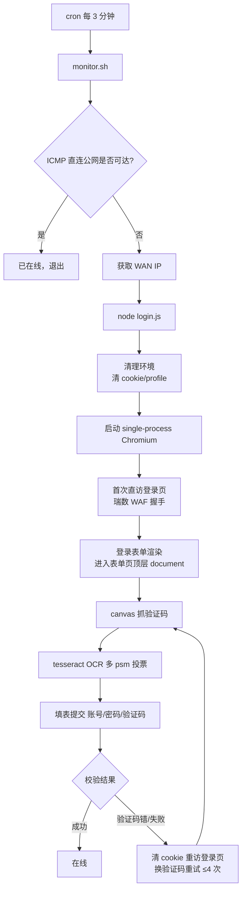
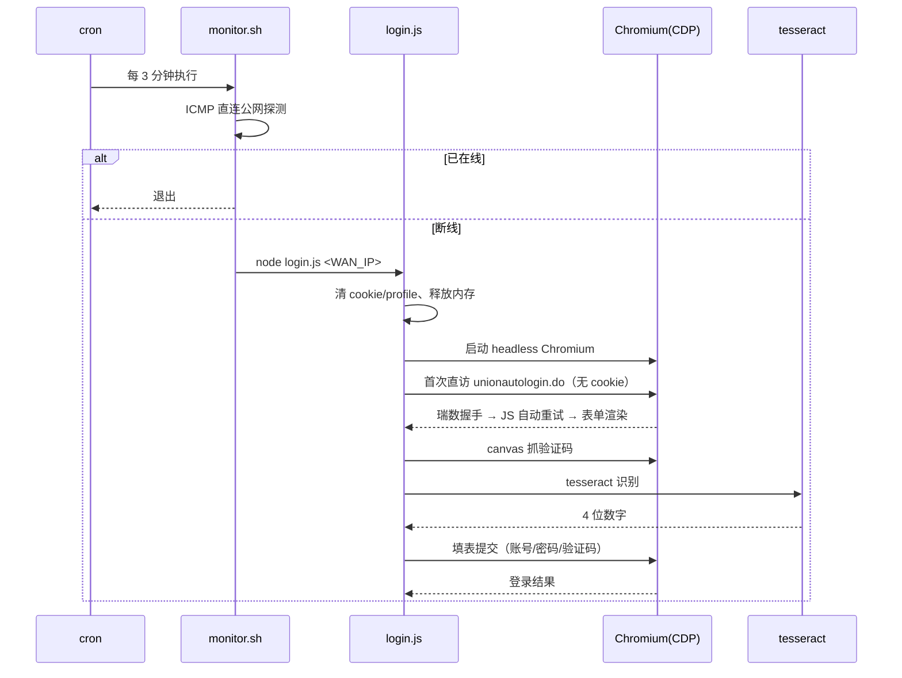
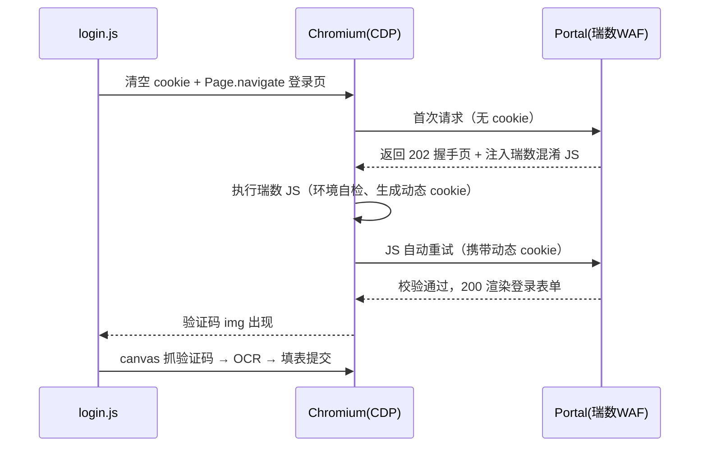
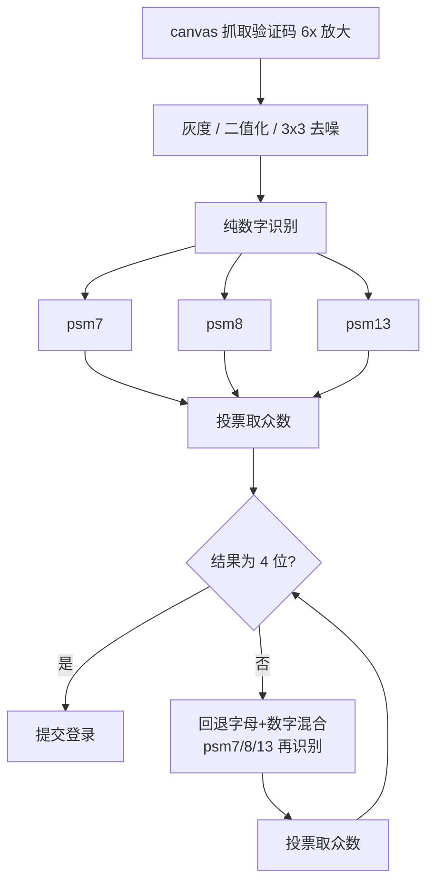

# 西南科技大学宿舍移动宽带自动登录示例脚本


西南科技大学宿舍移动宽带（CMCC-GXSD）自动登录示例。路由器（OpenWrt）定时检测断线，一旦发现掉线，自动完成"瑞数WAF握手 → 渲染登录表单 → 验证码OCR → 提交认证"的完整流程，无需手动输入手机号、密码、验证码。

> 本项目为**示例脚本**，所有账号、密码、MAC、IP 均以占位符呈现，使用前请按自己学校的实际情况替换。
> 方案与实现已在真实路由器上验证可用（见"十、验证记录"）。本文档按"为什么做 → 做了什么 → 遇到什么坑 → 怎么解决"完整记录全过程。

---

## 一、背景与痛点

宿舍移动宽带（CMCC-GXSD）每次连接都需要在 Portal 页面手动登录：

1. 浏览器访问任意 http 网页会被重定向到校园网 Portal（`http://218.200.239.185:8888`）
2. 登录表单在 iframe `unionautologin.do` 中渲染
3. 需要输入：**手机号（账号）+ 密码（手机号后六位）+ 4 位验证码**
4. 断线/会话过期后要**重新手动登录**

**痛点**：
- 每次都要输入三样东西，验证码还要盯着看、手动抄
- 网络偶尔断线就要重来一遍，非常繁琐
- 希望"只要断网就自动完成校园网登录"，完全不用管

### 校园网认证机制原理

- **Portal 认证**：校园网采用 Portal（Web）认证。未认证时，BRAS/AC 会拦截上网流量，并把 HTTP 请求**重定向**到 Portal 服务器（`http://218.200.239.185:8888`），让用户先完成网页认证
- **CGN 地址**：认证前 WAN 口拿到的是运营商内网保留地址（CGN，`100.64.0.0/10`），不是公网 IP；只有认证通过后流量才被放行
- **认证三要素**：设备 MAC（设备身份）+ 账号密码（用户身份）+ 验证码（人机校验），缺一不可
- **会话性**：认证有有效期，超时或 IP 变更后失效，需要重新认证——这就是"断线要重登"的根本原因

---

## 二、方案选型（为什么最终选方案B）

### 尝试 1：纯数据流登录（curl 模拟 POST）→ ❌ 不可行

一开始想用 curl 直接模拟登录表单的 POST 请求（用户名/密码/验证码），完全绕过浏览器。

**为什么不行**：校园网 Portal 部署了**瑞数信息（RiverSecurity）反爬虫 WAF（v5+）**。它会在响应中注入一段 JS，浏览器执行后生成**动态 cookie**（`FSSBBIl1UgzbN7NS` / `FSSBBIl1UgzbN7NT`），后续请求必须携带。curl 没有 JS 执行环境，无法生成该动态 cookie，直接被 400 拦截。

**失败链条**（为什么纯数据流必然失败）：
1. Portal 页面被瑞数 WAF 包裹：首次请求返回的不是纯登录表单，而是"注入瑞数 JS 的空壳页面"
2. 必须执行瑞数 JS 才能生成动态 cookie，拿到 cookie 后页面才真正加载登录表单
3. curl 没有 JS 引擎 → 无法生成动态 cookie → 后续任何请求（含表单 POST）都被 400 拦截
4. 即便绕过 WAF 拿到表单，登录提交还可能需要一次性 token / 会话绑定字段，纯数据流难以完整模拟

### 尝试 2：方案A（笔记本上跑脚本）→ ❌ 被否决

想在笔记本上跑自动登录脚本。用户否决：笔记本会随身带、经常移动，不需要在笔记本上常驻跑脚本。

### 尝试 3：方案B（路由器端 headless 浏览器）→ ✅ 选定

**为什么选路由器**：路由器固定联网、一直开机、WAN 口就是宽带入口，是"断线自动重连"最合适的位置。路由器需要一台真正的浏览器来执行瑞数 JS → 在路由器上装 **headless Chromium + CDP** 自动化。

---

## 三、整体架构

```
cron（每3分钟）──► monitor.sh ──► 检测断线（ICMP 直连公网）
                                     │ 断线
                                     ▼
                              login.js（Node + CDP）
                   ┌──────────────────────────────────┐
                   │ 1. 清理环境（清 profile/会话）   │
                   │ 2. 启动 single-process Chromium   │
                   │ 3. 首次直访 unionautologin.do     │
                   │    （瑞数 WAF 握手 → 表单渲染）    │
                   │ 4. canvas 抓取验证码 → tesseract  │
                   │ 5. 填表提交（账号/密码/验证码）    │
                   │ 6. 校验结果（登录成功/失败）       │
                   └──────────────────────────────────┘
```

**可视化架构**：



- **monitor.sh**：负责"检测 → 触发"，由 cron 每 3 分钟执行
- **login.js**：负责"登录全流程"，Node.js 通过 CDP 驱动 Chromium，OCR 识别验证码

**原理说明**：
- **为什么用 ICMP 直连探测判在线**：`curl` 探测外网时流量会被路由器上的代理软件（如 openclash）接管，校园网真实掉线时探测仍可能返回 200，造成"假在线"。ICMP（ping）不被代理劫持，走内核真实路径，掉线时全 loss、在线时畅通；多个公网 IP 轮流探测避免单点误判
- **WAN IP 为什么必须实时获取**：认证提交需要携带当前 `wlanuserip`，而 CGN 地址每次拨号可能变化，所以登录前必须现取现用
- **为什么整套逻辑放路由器**：路由器固定联网、是流量出口，天然适合"检测-重连"；cron 每 3 分钟轮询，登录脚本在自身进程内完成 Chromium 完整生命周期（不受 SSH 会话影响）

**登录流程时序图**：



---

## 四、路由器端实施全过程（做了什么，为什么）

路由器：OpenWrt 系（aarch64），低内存环境。SSH 地址如 `192.168.x.x`。

### 1. 确认 WAN 口身份（MAC 对齐）

运营商按**设备 MAC** 认证，且 WAN 口拿到的 IP 是运营商 CGN 网段（`100.64.x.x` / `100.96.x.x`）。中途发现 WAN 口 MAC 被修改导致无法认证，通过 UCI 将 WAN 口 MAC 固定回本机有线网卡 MAC（`XX:XX:XX:XX:XX:XX`），保证运营商把"路由器 WAN 口"识别成自己的设备。

**原理**：运营商按 WAN 口 MAC 识别设备并建立认证会话（MAC 绑定）。若 WAN 口 MAC 与登记/分配 IP 时记录的设备不一致，即使账号密码正确也会认证失败。所以必须保证路由器 WAN 口 MAC 与认证设备一致。

### 2. 搭建 Chromium 运行环境（核心难点之一）

OpenWrt 官方仓库**没有 Chromium**。方案：
- 用 **Alpine Linux 的 `apk.static`**（静态编译的 apk，可脱离 Alpine 系统运行）以 `--root /opt/alpine` 方式**离线安装原生 ARM64 Chromium 150** 到 `/opt/alpine`
- 运行时需指定 `LD_LIBRARY_PATH=/opt/alpine/usr/lib:/opt/alpine/lib:/opt/alpine/usr/lib/pulseaudio` 才能找到 Alpine 的共享库
- 同时安装 **tesseract 5.4.1 OCR** 及英文语言包（`TESSDATA_PREFIX=/usr/share/tessdata`）

**为什么能这样装**：
- `apk.static` 是**静态链接**的 apk 包管理器，不依赖任何共享库，可在任意 Linux（含 OpenWrt）上直接运行
- `--root /opt/alpine` 把整套 Alpine 文件树装进**独立目录**，不污染 OpenWrt 系统本身
- Chromium 动态链接 Alpine 的 musl 库，而 OpenWrt 系统库不同，所以运行时必须用 `LD_LIBRARY_PATH` 显式指向 `/opt/alpine` 下的库路径

### 3. 安装 Node.js 运行环境

login.js 用 Node.js 写，依赖 `ws` 模块（CDP WebSocket 客户端）、`child_process`（启停 Chromium / tesseract）。脚本放在 `/root/campus/`。

### 4. 开发 login.js（登录全流程）

完整流程见"三、整体架构"。要点：
- **瑞数 WAF 握手**：必须用不带 `webdriver` 自动化标志的 Chromium，才能通过瑞数 JS 校验、拿到动态 cookie
- **双密码字段**：登录表单有 `passwordIn_1`（name=password，服务器读取的主字段）和 `pwd` 两个密码字段，**两个都要填**，否则提交报密码错误
  - **来历**：表单由移动认证模板生成，`passwordIn_1` 是服务器实际读取的主字段，`pwd` 是同页面的兼容字段。漏填任何一个，服务器都可能判为"密码不正确"
- **互斥锁**：`/tmp/campus_login.lock`，防止 cron 并发触发多个登录实例争抢 CDP
- **全局超时 + 显式清理**：190s 全局超时保护，所有路径退出时 `killall chromium` + 释放锁，避免内存紧张的 OpenWrt 残留卡死进程

### 5. 开发 monitor.sh（检测与触发）

- 在线检测：`curl https://www.baidu.com` 返回 200 即视为已联网，直接退出
- 断线时：获取当前 WAN IP（`ip route get 1.1.1.1` 源地址，回退找 CGN 网段），调用 `node login.js <WAN_IP>`
- 目录锁 `/tmp/campus_monitor.lock` 防止 cron 并发
- 配置 cron 每 3 分钟执行一次

**原理**：
- **为什么用 baidu 而非内网探测**：见"三、整体架构"原理说明——外网可达才是"已认证"
- **WAN IP 获取**：`ip route get 1.1.1.1` 返回的 `src` 即当前默认路由源地址（WAN 口 IP）；断线时可能拿不到，回退扫描 `100.64/100.96` CGN 网段

### 6. 内存优化（低内存环境的前提，贯穿全程）

本项目最大的坑是 Chromium 在低内存设备上**无法启动**（详见"七、踩坑与解决"坑8）。技术细节如下：

**为什么起不来（根因）**：
- Chromium 主程序约 254MB，启动时要 mmap 读取大量二进制与资源文件，同时分配渲染内存
- 低内存设备可用内存不足时，内核触发换页（swap）：一边把匿名页写进 swap，一边读 Chromium 的库文件
- 两类 I/O 同时冲击**块设备请求队列**（blk-mq），请求槽位（tag）耗尽，进程卡死在 `blk_mq_get_tag`（内核栈实测），表现为永久 `D (disk sleep)`，CDP 永远起不来

**优化手段（按效果排序）**：

1. **zram 压缩交换（用 CPU 换内存，效果最大）**
   - 原理：把一块内存用作"可压缩的 swap"（zram 块设备）。匿名页被换出时先用 zstd 压缩再存入，压缩比约 2.8x——等效内存扩大近 3 倍
   - 对比：普通 swapfile 放在 USB/Flash 上，读写慢且占 I/O 队列；zram 在内存里，压缩/解压用 CPU，比磁盘 swap 快得多
   - 配置：`zram_size_mb=512`、`zram_comp_algo=zstd`
   - 为什么 zstd：比默认 lzo 压缩比更高（省更多内存），代价是 CPU 略高——这正是"用 CPU 换内存"
2. **调高 swappiness=100**：让内核更积极地换出匿名页到 zram，物理内存尽量留给 Chromium；配合 zram 后换页成本低
3. **降低 I/O 风暴**：`nr_requests=256`（加大队列容量）、`read_ahead_kb=16`（减少 Chromium 二进制预读风暴）
4. **释放 page cache**：登录前 `echo 3 > /proc/sys/vm/drop_caches`，把可回收缓存清掉，立即提升 MemAvailable
5. **暂停高占用服务**：登录前暂停非必要的常驻服务（login.js 中通过 `MEM_SERVICES` 配置），再配合以上手段，MemAvailable 实测从 ~90MB → **222MB**
6. **Chromium 单进程模式**：`--single-process` 让所有组件（浏览器/渲染/GPU）跑在单进程内，避免 fork 多个进程的内存峰值，显著降低启动内存需求

**实测效果（MemAvailable 变化）**：

| 阶段 | 可用内存 |
|------|---------|
| 优化前（系统服务满载） | ~90MB（Chromium 无法启动） |
| 释放 page cache + 暂停高占用服务后 | 222MB |
| Chromium 稳定运行期间 | ~146MB |

> 效果：优化后 Chromium 稳定启动 CDP（实测 `Chrome/150.0.7871.181`），瑞数握手通过，登录成功。

---

## 五、文件说明

| 文件 | 作用 |
|------|------|
| `login.js` | 核心登录脚本（Node.js + CDP + OCR）。运行于路由器 |
| `monitor.sh` | 断线检测 + 触发登录。由 cron 定时执行 |
| `ocr_test.js` | 独立验证码识别测试脚本（调 tesseract，跑 psm7 纯数字） |
| `captcha_samples/` | 真实抓取的验证码样本（原始图 / 预处理后图） |
| `README.md` | 本文档 |

---

## 六、瑞数 WAF 原理与绕过细节

校园网 Portal 使用的是**瑞数信息（RiverSecurity）反爬虫 WAF**（本项目实测为 v5+ 版本）。它是整个方案"为什么必须用真实浏览器"的根源。

### 1. 工作原理（实测可观测行为）

**① 动态 Cookie 令牌**
- 服务端在返回 HTML 时，注入一段**深度混淆的 JS**（瑞数脚本）
- 真实浏览器执行该 JS 后，会在客户端计算生成**动态 cookie**，本项目实际观测到两个：
  - `FSSBBIl1UgzbN7NS`
  - `FSSBBIl1UgzbN7NT`
- 后续所有 HTTP 请求必须携带这些 cookie，否则服务器直接返回 **400 Bad Request**

**② 动态性（无法静态复用）**
- cookie 值由**页面加载时间、访问 IP、会话状态**等多因素实时计算，随时间变化
- 也就是说：即使手动登录一次把 cookie 复制出来，过一会儿就失效；换 IP 也失效
- 这从根上否定了"curl + 复用 cookie"这类轻量方案

**③ JS 环境指纹检测**
- 瑞数 JS 在执行时探测运行环境，确认它是"真实浏览器"：
  - 标准浏览器对象（`document`、`navigator`、`window` 的完整属性）
  - Canvas/WebGL 渲染指纹、字体、屏幕等特征
  - JS 引擎行为特征（真实 V8 的执行细节）

**④ 自动化检测**
- 检测 `navigator.webdriver` 标志
- 检测 Chrome DevTools 协议（CDP）连接痕迹
- 检测自动化工具注入的全局变量（如 Puppeteer 的 `window.cdc_` 前缀对象）
- 检测 headless 浏览器的行为差异

### 2. 本项目遇到的拦截现象

| 尝试 | 结果 |
|------|------|
| `curl` 模拟 POST | 无法执行瑞数 JS → 无动态 cookie → **400 拦截** |
| CDP 控制的自动化浏览器（带自动化痕迹） | 访问 `unionautologin.do` 返回 **400 Bad Request** |
| 真实浏览器 | ✅ 正常渲染登录表单 |
| 无自动化痕迹的 headless Chromium（路由器） | ✅ 瑞数握手通过，拿到登录 iframe |

### 3. 绕过细节（本项目实际做法）

**① 用完整浏览器内核，而不是轻量模拟**
- 最终采用 **headless Chromium**（完整 Chromium 内核），能真正执行瑞数混淆 JS，算出动态 cookie
- 不用任何"伪浏览器"（如 jsdom、简单 JS 引擎）——瑞数会校验真实 V8 与 DOM 环境，伪环境过不了

**② 消除自动化痕迹（关键）**
- **直接调用 Chromium 二进制**，不用 Puppeteer/Playwright 等包装库。这些库会默认注入自动化标志（`--enable-automation`、`window.cdc_` 等），是瑞数检测的重灾区
- 启动参数刻意**不带** `webdriver`/自动化相关标志：
  ```sh
  chromium --headless=new --no-sandbox --disable-dev-shm-usage --disable-gpu ...
  ```
- 设置**正常浏览器 UA**，与真机一致

**③ 真实导航生命周期**
- 用 `Page.navigate` 让 Chromium **真正加载页面**（而不是 fetch/模拟请求），瑞数 JS 有完整生命周期执行、生成并写入动态 cookie
- 等瑞数 JS 执行完成（拿到 cookie）后，再进入登录流程

**④ 直接首访登录页（关键，v3 实测）**
- 登录表单页 `unionautologin.do` 的 URL 参数（`brasip`、`redirectUrl` 等）在门户响应中恒定，可直接拼装
- 流程：**清空 cookie → 首次直接导航 `unionautologin.do`** → 返回 202 握手页 → 页面内瑞数 JS 自动重试 → 200 渲染登录表单
- 注意：**不能先访问门户首页再跳转 iframe**。先访问首页会建立"脏会话"，之后该会话内的所有后续请求（iframe、fetch、甚至导航）都会被瑞数以 400 拒绝——因为动态 cookie 与请求签名的指纹校验失败时，瑞数直接返回 400 空页
- 首页 `frameset` 中的 iframe `src` 只是用来**提取登录页 URL 参数**作为参考；提交与验证码操作都在登录页自身的顶层 document 进行（同源，无跨域限制）

**⑤ 不注入 stealth 脚本（关键，v3 实测）**
- 不要用 `Page.addScriptToEvaluateOnNewDocument` 改写 `navigator.webdriver`/`plugins` 等属性：自定义 getter 会改变属性描述符，瑞数高级检测反而更容易识别（登录页会停在空壳、不渲染表单）。**干净的直接导航反而能通过**
- 用 `--disable-blink-features=AutomationControlled` 启动参数消除 webdriver 自动化特征即可

**⑥ 每次登录清 cookie + profile**
- 瑞数动态 cookie 绑定会话且一次性：登录前清空 cookie、删除 Chromium profile（`rm -rf`），复用旧 `JSESSIONID`/`FSSBBI` cookie 会被直接拒绝（页面停在 202/400 空壳，无登录表单）

**⑦ 与真实浏览器行为一致**
- 先用真实浏览器完整走通登录流程（确认表单字段、验证码、提交逻辑、双密码字段），再把同一套逻辑搬到路由器的 headless Chromium，行为一致才能通过校验

### 4. 握手时序（完整生命周期）

瑞数 WAF 的校验发生在"首次页面加载"这个完整生命周期里，缺任何一步都会 400：

1. 浏览器发出首次请求 → 服务器返回 HTML，其中**内嵌瑞数混淆 JS**（通常位于 `<script>` 块或 HTML 尾部）
2. 浏览器解析 HTML、执行瑞数 JS：
   - JS 先做**环境自检**：判断是否真实浏览器、是否被自动化控制（见上文 1-③/1-④）
   - 自检通过后，基于**时间戳 + 访问 IP + 随机数 + 环境特征**计算动态 cookie（`FSSBBIl1UgzbN7NS/NT`），通过 `document.cookie` 写入
   - 部分版本会触发**一次自动重载**：带新 cookie 重新请求页面，让服务端确认 cookie 有效
3. 页面正常渲染；此后**同一会话的所有后续请求**都会被校验（动态 cookie 与请求签名、指纹绑定，校验失败即 400）
4. 本项目直接导航登录页触发完整生命周期，然后**轮询等待关键元素出现**（登录表单的验证码 img）——出现即说明 WAF 校验已通过，才继续操作

**握手时序图**：



### 5. 更细的绕过要点（实测）

- **headless=new 模式**：Chrome 的新 headless 用完整渲染管线（真实 compositor / 网络栈），比老 `--headless` 更接近真机，瑞数更难分辨
- **CDP 域用最少**：登录页流程只需要 `Page`、`Runtime`、`Network`（清 cookie）三个域。**不要用 `addScriptToEvaluateOnNewDocument` 注入 stealth**（实测反而被识别，见"绕过细节 ⑤"）
- **等待靠"元素出现"而非固定延时**：瑞数 JS 自动重试耗时约 3~10 秒（受设备性能影响），用轮询等待验证码 img 出现，确保 JS 完成后再操作
- **验证码只读不 fetch**：直接 canvas 绘制页面上已有的 ``，不重新请求图片 URL，避免换码（详见"八、验证码识别"）
- **UA 保持一致**：实测即便 UA 声明的平台与实际运行环境不完全一致也能通过（瑞数主要校验 JS 环境而非 UA 字符串），但保持常规浏览器 UA 更稳妥
- **登录前清空 cookie + 清 profile**：见"绕过细节 ⑥"，复用旧会话 cookie 会直接 400

### 6. 反制与失效风险

- 瑞数会**持续升级**：指纹特征库、cookie 算法、JS 混淆都会更新，版本一变，原有绕过参数可能需要相应调整
- cookie **动态且绑定 IP/会话**：换 IP、过有效期即失效——这正是"断线重连必须重新走完整流程"的原因
- 本方案依赖"真实浏览器 + 正常生命周期"这一**环境一致性**路径，而非漏洞利用；升级后通常调整参数即可恢复，无需重写核心逻辑

### 7. 如何确认 WAF 已通过（诊断）

- 页面响应不再是 400（正常 200）
- 登录页（`unionautologin.do`）顶层 `document.getElementById('randomimage')`（验证码）存在且 `naturalWidth > 0`，说明登录表单已真实渲染（v3 直接在登录页顶层 document 操作，不再依赖门户首页 frameset/iframe）

> 小结：绕过的本质不是"欺骗"瑞数，而是**提供一个它认为是真实浏览器的完整环境**。瑞数检测自动化靠"环境指纹 + 行为一致性"，只要用的是干净的真实内核、走正常页面生命周期、不暴露自动化痕迹，就能通过。

---

## 七、踩坑与解决（完整清单）

### 坑1：瑞数 WAF 拦截自动化浏览器

- **现象**：CDP 控制的浏览器访问登录页 `unionautologin.do` 返回 **400 Bad Request**
- **原因**：自动化浏览器带 `webdriver` 标志，被瑞数 JS 环境检测识别
- **解决**：改用不带自动化标志的真实浏览器（本地用真实浏览器验证了完整登录流程；路由器上用无 webdriver 标志的 headless Chromium）绕过检测
- **原理与完整绕过细节**：见"六、瑞数 WAF 原理与绕过细节"

### 坑2：验证码 OCR 识别率低

- **现象**：tesseract 识别结果与真实字符差异大（如把 "7461" 识别成 "9264"）
- **原因**：验证码低分辨率、有抗锯齿和干扰，直接 OCR 噪声大
- **解决**：图像预处理（灰度 → 自适应二值化 → 3x3 邻域去噪）+ **多 psm（7/8/13）投票**提高可靠性

### 坑3：路由器端 tesseract 找不到语言包

- **现象**：`Error opening data file ./eng.traineddata`
- **原因**：tesseract 默认在相对路径找语言包
- **解决**：调用时显式设置环境变量 `TESSDATA_PREFIX=/usr/share/tessdata`

### 坑4：验证码截图截断/空白

- **现象**：通过 CDP `DOM.getBoxModel` 获取验证码元素坐标再截图，结果经常截断或空白
- **原因**：headless 下坐标/缩放不可靠
- **解决**：改用**页面内 canvas 直接绘制验证码 img 元素并 6 倍放大**，返回 base64 由 Node 端写文件，彻底摆脱坐标依赖

### 坑5：登录结果误判

- **现象**：未识别"登录失败"页面，被误判为 timeout
- **原因**：结果判断只看了 body 文本，登录失败页的标题特征没纳入
- **解决**：把 `document.title` 纳入判断逻辑，补充"登录失败"状态检测

### 坑6：WAN 口 MAC 被改导致无法认证

- **现象**：路由器 WAN 口 MAC 与认证设备不一致，运营商不认，认证失败
- **解决**：通过 UCI 将 WAN 口 MAC 固定回本机有线网卡 MAC（`XX:XX:XX:XX:XX:XX`）

### 坑7：并发登录实例冲突

- **现象**：多个 login.js 同时运行，争抢 CDP 连接导致超时
- **原因**：cron 每 3 分钟触发，上一个还没退出
- **解决**：文件锁（`/tmp/campus_login.lock`）+ 目录锁（`/tmp/campus_monitor.lock`）防止并发

### 坑8：Chromium 启动超时 / 内存不足（本项目最大的坑）

- **现象**：`available` 内存一度只有 91MB，Chromium 无法启动 CDP；即使把 swap 扩到 767MB，仍报"CDP 启动超时"，进程永久卡在 `D (disk sleep)` 状态
- **根因定位**：读 `/proc/<pid>/stack`，内核栈显示
  ```
  blk_mq_get_tag ← __swap_writepage / ext4_readahead
  ```
  → **物理内存不足**，Chromium（主程序 254MB）一启动就触发 **swap 写 + 读库文件 I/O 风暴**，把块设备请求队列（blk-mq tag）挤爆，进程永久卡死在内核 I/O 等待
- **为什么之前能成功一次**：这台路由器跑 Chromium 是"临界操作"，内存空档大时能成，内存被系统服务占满时必死
- **解决链**（逐步释放/降低内存需求）：
  1. 在 `/mnt/sda1` 建 **512MB swapfile** 并持久化到 `/etc/rc.local`
  2. **zram 扩容**：243MB（lzo）→ **512MB（zstd）**，zstd 压缩比约 2.8x——用 CPU 压缩换取更多可用内存
  3. 调优：`swappiness=100`（积极使用 CPU 压缩的 zram）、`vfs_cache_pressure=50`、`min_free_kbytes=8192`、sda 队列 `nr_requests=256`、`read_ahead_kb=16`（降低 I/O 风暴）
  4. **登录前释放高占用服务的内存**（约 84MB）：MemAvailable 从 ~90MB → **222MB**
  5. **Chromium 用 `--single-process` 单进程模式**：避免 fork 渲染进程的内存峰值，稳定启动
  - **突破**：MemAvailable 222MB + single-process → CDP 就绪，瑞数握手通过，**真实登录成功**

### 坑9：SSH 会话断开后进程被杀

- **现象**：通过 SSH 启动的后台 Chromium，SSH 一断就被清理
- **原因**：OpenWrt 的 dropbear 把会话放进 cgroup，SSH 结束 procd 会销毁该 cgroup
- **解决**：login.js 在**自身进程内**完成"启动 Chromium → 登录 → 杀 Chromium"，不依赖后台长驻；诊断脚本则先把自己写入根 cgroup（`echo $$ > /sys/fs/cgroup/cgroup.procs`）再后台运行

### 坑10：cron 触发叠加卡死实例

- **现象**：monitor 每 3 分钟触发一次 login.js，卡死的 chromium/login.js 叠加占用资源
- **解决**：互斥锁 + `GLOBAL_TIMEOUT`（190s）全局超时保护 + 所有路径显式 `killall chromium` 并释放锁

---

## 八、验证码识别

验证码为 4 位纯数字（低分辨率、带抗锯齿/干扰），由 `login.js` 中的 `grabCaptcha()` + `captchaToCode()` + `ocr()` 完成。流程如下：

### 1. 抓取（不触发服务器刷新）

通过 CDP 在页面内用 canvas 直接绘制验证码 `` 元素，**6 倍放大**后导出 PNG。不重新 fetch 图片 URL（避免让服务器换一张验证码，导致后续提交对不上）。

### 2. 图像预处理（在 canvas 内完成）

```js
// ① 灰度：加权平均（人眼亮度模型）
g = 0.3 * R + 0.6 * G + 0.1 * B

// ② 自适应二值化：阈值取全图平均灰度的 0.88
//    深色字符 → 黑(0)，浅色背景 → 白(255)
th = avg(gray) * 0.88

// ③ 3x3 邻域去噪：孤立黑点（周围黑像素 ≤ 2）置白
//    只去噪不膨胀，避免数字 5 的开口被填成 8
```

### 3. OCR 识别（多 psm 投票）

```js
// 纯数字优先：psm 7 / 8 / 13 三种模式各识别一次
// 取出现次数最多的结果（平局取靠前，psm7 通常最准）
// 结果必须恰好 4 位才采纳
num = [ocr(7), ocr(8), ocr(13)]  →  vote()
// 纯数字不足 4 位时，回退字母+数字混合字符集再试
mix = [ocr(7), ocr(8), ocr(13)]  →  vote()
```

- 数字字符白名单：`0123456789`
- 混合白名单：`A-Za-z0-9`（运营商验证码基本为纯数字，故数字优先）
- 超时保护：单次 tesseract 调用 20s；`TESSDATA_PREFIX=/usr/share/tessdata` 显式指定语言包

**多 psm 投票流程图**：



### 4. 失败重试

- OCR 未识别出 4 位 → 刷新登录表单（重新加载 iframe，换新验证码）→ 下一轮
- 服务器返回"验证码错误" → 同样刷新重试
- 最多 4 次（`MAX_TRY`），仍失败则本次放弃，等 3 分钟后 cron 再次触发

### 5. 样本与本地测试

**验证码原始样本**（真实抓取：4 位紫色数字、低分辨率、带抗锯齿/干扰）：

| 原始样本 1 | 原始样本 2（内容 6112） |
|---|---|
|  |  |

**预处理对比**（左侧原始 → 右侧 6 倍放大 + 灰度二值化 + 3x3 去噪，供 tesseract 识别）：

| 原始 | 预处理后 |
|---|---|
|  |  |

**路由器端 headless Chromium 抓取示例**：


- `captcha_samples/`：上述真实抓取的验证码样本（`captcha_orig1/2` 原始图、`captcha_processed` 预处理后、`captcha_router` 路由器端抓取）
- `ocr_test.js`：独立测试脚本，验证路由器 tesseract 是否可用及识别效果

```sh
# 在路由器上对某张验证码图跑一次识别（psm7 纯数字）
node ocr_test.js /tmp/captcha.png
```

---

## 九、部署步骤

### 1. 放置脚本

将 `login.js`、`monitor.sh` 上传到路由器 `/root/campus/`，并赋权：

```sh
mkdir -p /root/campus
# 上传两个文件到 /root/campus/
chmod +x /root/campus/monitor.sh /root/campus/login.js
```

### 2. 配置定时检测（cron）

```sh
echo '*/3 * * * * /root/campus/monitor.sh >/dev/null 2>&1' >> /etc/crontabs/root
/etc/init.d/cron restart
```

### 3. 内存优化持久化（关键，低内存环境的前提）

```sh
uci set system.@system[0].zram_size_mb='512'
uci set system.@system[0].zram_comp_algo='zstd'
uci commit system

cat >> /etc/rc.local <<'EOF'
echo 100 > /proc/sys/vm/swappiness 2>/dev/null
echo 256 > /sys/block/sda/queue/nr_requests 2>/dev/null
echo 16 > /sys/block/sda/queue/read_ahead_kb 2>/dev/null
EOF
```

（已有 `/mnt/sda1/swapfile` 作为慢速兜底 swap；zram 优先级更高、更快。）

### 4. 配置账号（使用前必须替换）

`login.js` 顶部常量：

```js
const ACCOUNT = 'SCXY****************'; // 校园网账号（按学校要求带前缀）
const PASS    = '****************';     // 密码（通常为手机号后六位）
const BASE    = 'http://218.200.239.185:8888'; // 校园网 Portal 地址
```

### 5. 手动测试

```sh
# 断线状态下获取 WAN IP（如 100.64.x.x），执行完整登录：
cd /root/campus && node login.js <WAN_IP>

# 只测"导航 + 验证码 + OCR"，不提交（dry 模式）：
cd /root/campus && node login.js <WAN_IP> --dry
```

日志：
- 登录详情：`/tmp/login.log`
- 检测/触发记录：`/tmp/campus_monitor.log`

---

## 十、验证记录（实际执行）

**环境**：OpenWrt，Chrome/150.0.7871.181，tesseract 5.4.1，node + ws。

1. **根因定位**：低内存下 Chromium 启动卡死在 `blk_mq_get_tag`（swap+I/O 风暴），通过内核栈确认
2. **解法**：登录前清 profile/缓存 + `--single-process` 单进程模式（v3 起不再停代理服务——登录页为 IP 直连，代理不劫持，详见"绕过细节"）
3. **Chromium CDP 就绪**：`{"Browser": "Chrome/150.0.7871.181"}`
4. **瑞数 WAF 握手通过**：首次直访登录页渲染出验证码表单（`unionautologin.do`）
5. **真实登录成功**（cron 自动触发）：
   ```
   识别验证码: 3959
   提交: submitted
   resp[0]: |TITLE:登录成功
   结果: ok
   LOGIN_OK   (登录脚本退出码=0)
   ```
6. **当前状态**：登录后已在线，服务正常
7. **2026-09-05 断线自愈修复记录**（重新完整跑通）：
   - **发现**：某次掉线后自动登录反复失败、网络长时间未恢复，新增的失败现场日志定位到"登录页停留 202 空壳"
   - **三个根因**（已全部修复，细节见"六、瑞数 WAF 原理与绕过细节"）：
     1. 误加 stealth 注入（改写 `navigator` 属性）→ 被瑞数识别，登录页不渲染 → **去掉即可**
     2. 先访问门户首页建立"脏会话" → 后续所有请求被 400 → **改为清 cookie 后首次直访登录页**
     3. 登录前停 openclash → procd 复活/进程互杀导致 Chromium 崩溃(socket hang up) → **IP 直连无需停服，砍掉该逻辑**
   - **修复后真实日志**（手动触发完整登录）：
     ```
     打开登录页: http://218.200.239.185:8888/portalserver/user/unionautologin.do?...
     登录表单已渲染，验证码就绪
     识别验证码: 6447
     提交: submitted
     resp[0]: |TITLE:登录成功
     结果: ok
     LOGIN_OK
     ```
   - **修复后自愈闭环**：monitor 每 3 分钟 ICMP 真实判定掉线 → 触发 v3 登录 → 一次成功在线

**真实运行痕迹**（路由器端 headless Chromium 通过 CDP 抓取的验证码，证明整套流程真实跑通）：


> 完整真实日志：登录详情 `/tmp/login.log`（含每次验证码识别、提交、结果判定），触发记录 `/tmp/campus_monitor.log`。

---

## 十一、已知限制与注意事项

- **内存临界**：内存被系统服务占满时 Chromium 起不来。登录前清 profile/缓存腾内存；若实际环境内存紧张，可在 `MEM_SERVICES` 配置登录前暂停高占用服务、登录后恢复（脚本已支持，默认关闭）
- **瑞数 WAF**：必须真实浏览器环境（本方案用 headless Chromium），纯 curl 无法通过动态 cookie 校验
- **验证码 OCR**：纯数字识别优先（psm 7/8/13 投票），失败自动刷新重试，最多 4 次；仍失败则本次放弃，等下次 cron 重试
- **WAN IP 变化**：登录需要当前 WAN IP（monitor.sh 自动获取）
- **互斥锁**：`/tmp/campus_login.lock` 防止并发登录；异常退出自动清理
- **日志**：登录详情写入 `/tmp/login.log`，触发记录写入 `/tmp/campus_monitor.log`
